# YiKdWebClient

YiKdWebClient 是一个用于调用 **金蝶云星空 WebAPI** 的轻量级 .NET 客户端。项目使用原生 HTTP 协议实现，移除了对金蝶官方 SDK 和 `Newtonsoft.Json` 的依赖，可用于 .NET、.NET Framework 与 .NET Standard 项目。

项目主要提供：

- 第三方系统登录授权、SHA256/SHA1 签名、集成密钥文件、旧版用户名密码等认证方式；
- API 请求头签名模式；
- 保存、审核、查询、下推、附件上传等常用 WebAPI 封装；
- 单点登录 SSO V1～V4；
- 自定义 WebAPI 调用；
- 登录与业务请求的真实 URL、请求头、请求报文和返回报文，便于使用 Postman、ApiPost 等工具排查问题。

> [!WARNING]
> 仓库中的 `appsettings.xml` 和运行截图使用的是作者本机测试环境信息，仅用于演示。接入自己的环境时，必须替换数据中心 ID、集成用户、应用 ID、应用密钥、服务地址和集成密钥文件。请勿把生产密钥、生产密码或长期有效的会话信息提交到公开仓库。

> [!IMPORTANT]
> 旧版 `demo` 用户密码没有写入源码、README 或截图。`validate-login` 示例只从 `YIKD_VALIDATE_PASSWORD` 环境变量读取密码，控制台展示真实请求结构时会把密码替换为 `******`。

## 目录

- [1. 相关资料](#1-相关资料)
- [2. 安装](#2-安装)
- [3. 配置 appsettings.xml](#3-配置-appsettingsxml)
- [4. 五分钟运行第一个示例](#4-五分钟运行第一个示例)
- [5. ConsoleTestNet80 示例运行器](#5-consoletestnet80-示例运行器)
- [6. 认证与请求示例](#6-认证与请求示例)
- [7. JSON 参数与接口功能列表](#7-json-参数与接口功能列表)
- [8. 单点登录](#8-单点登录)
- [9. 自定义 WebAPI](#9-自定义-webapi)
- [10. 文件上传](#10-文件上传)
- [11. 框架兼容性与依赖](#11-框架兼容性与依赖)
- [12. 常见问题](#12-常见问题)
- [13. 重新生成 README 截图](#13-重新生成-readme-截图)
- [14. 项目地址](#14-项目地址)

## 1. 相关资料

- 金蝶云星空官方原始报文与地址结构说明：<https://vip.kingdee.com/knowledge/528587883691785472?productLineId=1&isKnowledge=2&lang=zh-CN>
- 官方 WebAPI 接口说明：<https://vip.kingdee.com/knowledge/407944297590364160?productLineId=1&isKnowledge=2&lang=zh-CN>
- 仓库内 WebAPI 接口说明书：[金蝶云星空 WebAPI 接口说明书 V6.0](./金蝶云星空WebAPI接口说明书_V6.0.docx)
- 仓库内 Postman 集合：[星空 WebAPI Postman Collection](./星空WebAPI.postman_collection.json.zip)
- NuGet：<https://www.nuget.org/packages/YiKdWebClient>

金蝶官方文档中的 JSON 是调用参数格式，不一定等于最终发送到 HTTP 接口的外层报文。YiKdWebClient 会把参数包装为金蝶 WebAPI 所需格式；最终报文可以通过客户端的 `ReturnLoginWebModel` 和 `ReturnOperationWebModel` 查看。

## 2. 安装

### 2.1 Visual Studio NuGet 管理器

在解决方案资源管理器中右击项目，选择“管理 NuGet 程序包”，搜索并安装 `YiKdWebClient`。

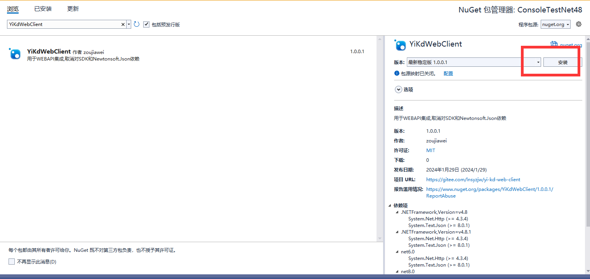

### 2.2 Package Manager Console

```powershell
Install-Package YiKdWebClient
```

### 2.3 .NET CLI

```powershell
dotnet add package YiKdWebClient
```

如果直接引用本仓库源码，可参考 `ConsoleTestNet80/ConsoleTestNet80.csproj` 中的 `ProjectReference`。

## 3. 配置 appsettings.xml

### 3.1 默认路径

默认配置文件相对运行目录的位置是：

```text
YiKdWebCfg/appsettings.xml
```

本仓库共有三份源配置，已统一为同一套本地测试认证信息：

- `YiKdWebClient/YiKdWebCfg/appsettings.xml`
- `ConsoleTestNet48/YiKdWebCfg/appsettings.xml`
- `ConsoleTestNet80/YiKdWebCfg/appsettings.xml`

构建时配置文件会复制到输出目录。请修改源文件，不要只修改 `bin` 或 `obj` 目录中的临时副本。

### 3.2 完整配置示例

下面是当前仓库的本地测试配置。**使用者必须替换为自己的授权信息。**

```xml
<?xml version="1.0" encoding="utf-8" ?>
<configuration>
  <appSettings>
    <!-- 数据中心 ID / 账套 ID -->
    <add key="X-KDApi-AcctID" value="6979b9812f3f89"/>

    <!-- 第三方系统登录授权中的集成用户 -->
    <add key="X-KDApi-UserName" value="Administrator"/>

    <!-- 第三方系统登录授权的应用 ID -->
    <add key="X-KDApi-AppID" value="354749_36dv7cio6mC5X8zLX/6tUa0M6JSU6sKE"/>

    <!-- 第三方系统登录授权的应用密钥；请替换 -->
    <add key="X-KDApi-AppSec" value="c1f59a3747c94804b6417872f1b272a6"/>

    <!-- 账套语系，简体中文通常为 2052 -->
    <add key="X-KDApi-LCID" value="2052"/>

    <!-- 启用多组织时可填写组织编码 -->
    <!--<add key="X-KDApi-OrgNum" value="100"/>-->

    <!-- 私有云通常填写以 K3Cloud/ 结尾的地址 -->
    <add key="X-KDApi-ServerUrl" value="http://127.0.0.1/K3Cloud/"/>
  </appSettings>
</configuration>
```

### 3.3 配置项说明

| 配置项 | 是否常用 | 说明 |
| --- | --- | --- |
| `X-KDApi-AcctID` | 是 | 数据中心 ID，也称账套 ID。可在第三方系统登录授权页面生成测试链接后查看。 |
| `X-KDApi-UserName` | 是 | 集成用户。PT-146894 `[7.7.0.202111]` 及后续版本可使用指定用户登录列表中的用户；若授权允许全部用户登录，则不受该列表限制。 |
| `X-KDApi-AppID` | 是 | 第三方系统登录授权的应用 ID。 |
| `X-KDApi-AppSec` | 是 | 第三方系统登录授权的应用密钥。不要使用生产密钥运行公开示例。 |
| `X-KDApi-LCID` | 是 | 账套语系，默认值为 `2052`。 |
| `X-KDApi-OrgNum` | 否 | 多组织场景中的组织编码，主要用于签名认证模式。 |
| `X-KDApi-ServerUrl` | 是 | 私有云填写产品地址，并以 `K3Cloud/` 结尾；使用公有云网关时按官方要求配置。 |

### 3.4 私有云与公有云网关

较新的公有云环境曾要求通过 `https://api.kingdee.com/galaxyapi/` 网关调用，网关方式需要 API 签名认证。根据原文档在 2024 年 10 月获得的信息，公有云当时不再统一强制使用网关；实际接入规则仍应以目标环境和金蝶官方最新要求为准。YiKdWebClient 已包含普通服务地址和签名相关能力。

## 4. 五分钟运行第一个示例

以下步骤适合第一次接触项目的开发者。

1. 安装 .NET 8 SDK，并确认 `dotnet --info` 可以正常执行。
2. 确认本机能够访问 `X-KDApi-ServerUrl`，当前示例地址是 `http://127.0.0.1/K3Cloud/`。
3. 将三份 `appsettings.xml` 替换为自己的数据中心、应用和服务地址。
4. 在仓库根目录构建示例：

   ```powershell
   dotnet build .\ConsoleTestNet80\ConsoleTestNet80.csproj -f net8.0
   ```

5. 查看全部示例命令：

   ```powershell
   dotnet run --project .\ConsoleTestNet80\ConsoleTestNet80.csproj -f net8.0 -- help
   ```

6. 运行推荐的 SHA256 签名示例：

   ```powershell
   dotnet run --project .\ConsoleTestNet80\ConsoleTestNet80.csproj -f net8.0 -- sign-sha256
   ```

控制台会依次显示登录请求与响应、业务请求与响应以及方法返回值。HTTP 请求完成并不代表业务一定成功，请继续检查返回报文中的 `LoginResultType`、`IsSuccessByAPI`、`ResponseStatus.IsSuccess`、`ErrorCode` 和 `Message`。

## 5. ConsoleTestNet80 示例运行器

README 中的示例已经移植到 `ConsoleTestNet80`。每个示例都有独立命令，不需要反复注释和取消注释 `Program.cs`。

```text
sign-sha256       签名信息认证（SHA256）
sign-sha1         签名信息认证（SHA1）
app-secret        第三方系统登录授权
validate-login    旧版用户名密码认证
simple-passport   集成密钥文件认证
api-sign-headers  API 请求头签名认证
dynamic-config    代码动态配置授权信息
custom-config-path 自定义配置文件路径
custom-webapi     调用自定义 WebAPI
sso-v4            单点登录 V4
upload-file       文件分块上传
upload-progress   文件分块上传（进度回调）
upload-base64     Base64 流分块上传
```

统一运行格式：

```powershell
dotnet run --project .\ConsoleTestNet80\ConsoleTestNet80.csproj -f net8.0 -- <示例命令>
```

### 5.1 可选环境变量

环境变量适合临时切换环境，不会修改仓库文件。

| 环境变量 | 用途 | 默认值或来源 |
| --- | --- | --- |
| `YIKD_CONFIG_PATH` | 自定义 `appsettings.xml` 路径 | 输出目录中的 `YiKdWebCfg/appsettings.xml` |
| `YIKD_CNF_PATH` | 集成密钥文件路径 | 输出目录中的 `YiKdWebCfg/API测试.cnf` |
| `YIKD_SERVER_URL` | 临时覆盖服务地址 | 从 XML 读取 |
| `YIKD_ACCT_ID` | 动态配置示例的数据中心 ID | 从 XML 读取 |
| `YIKD_USER_NAME` | 动态配置示例的集成用户 | 从 XML 读取 |
| `YIKD_APP_ID` | 动态配置示例的应用 ID | 从 XML 读取 |
| `YIKD_APP_SECRET` | 动态配置示例的应用密钥 | 从 XML 读取 |
| `YIKD_LCID` | 动态配置示例的语系 | 从 XML 读取 |
| `YIKD_ORG_NUM` | 动态配置示例的组织编码 | 从 XML 读取，可为空 |
| `YIKD_VALIDATE_DBID` | 旧版登录的数据中心 ID | 从 XML 读取 |
| `YIKD_VALIDATE_USERNAME` | 旧版登录用户名 | `demo` |
| `YIKD_VALIDATE_PASSWORD` | 旧版登录密码 | 无默认值，必须显式设置 |
| `YIKD_VALIDATE_LCID` | 旧版登录语系 | `2052` |
| `YIKD_UPLOAD_FILE` | 上传示例文件路径 | 输出目录中的 `SampleFiles/upload-demo.txt` |
| `YIKD_UPLOAD_FORM_ID` | 上传目标表单 ID | `SAL_SaleOrder` |
| `YIKD_UPLOAD_INTER_ID` | 上传目标单据内码 | `100020` |
| `YIKD_UPLOAD_BILL_NO` | 上传目标单据编号 | `XSDD000019` |
| `YIKD_UPLOAD_CHUNK_SIZE` | 上传分块大小（字节） | `2 * 1024 * 1024` |
| `YIKD_CUSTOM_SQL` | 自定义 WebAPI 示例 SQL | `SELECT TOP 10 * FROM T_BD_MATERIAL_L` |

### 5.2 截图说明

本 README 的 13 张示例截图均由 `ConsoleTestNet80` 在本地环境真实运行后生成，能够看到实际 URL、请求报文和返回报文。为了让图片在 GitHub/Gitee 中保持可读，截图模式只折叠超长字段和大响应的中间行；直接运行相同命令会输出完整报文。请求 ID、时间戳、签名、SessionId 和业务数据每次运行都可能不同。

## 6. 认证与请求示例

以下示例都查看 `SEC_User` 表单中的 `Administrator` 用户。为了方便初学者直接复制使用，本节**不共用任何代码变量**：每个代码块都重新声明 `formId`、`json`、`client` 和输出变量。只要项目已经引用 `YiKdWebClient`，并按第 5 节准备好配置文件，就可以把任意一个代码块单独复制到控制台项目的 `Program.cs` 中运行。

截图里的各项内容与客户端属性的对应关系如下；每个示例也会把这些属性先赋值给名称明确的局部变量，再输出到控制台：

| 截图中的内容 | 示例变量 | 数据来源 |
| --- | --- | --- |
| 表单 ID | `formId` | 调用方传给 `View` 的第一个参数 |
| 业务 JSON 参数 | `json` | 调用方传给 `View` 的第二个参数 |
| 登录请求地址 | `loginRequestUrl` | `client.ReturnLoginWebModel.RequestUrl` |
| 登录请求报文 | `loginRequestBody` | `client.ReturnLoginWebModel.RealRequestBody` |
| 登录返回报文 | `loginResponseBody` | `client.ReturnLoginWebModel.RealResponseBody` |
| 业务请求地址 | `operationRequestUrl` | `client.ReturnOperationWebModel.RequestUrl` |
| 业务请求报文 | `operationRequestBody` | `client.ReturnOperationWebModel.RealRequestBody` |
| 业务返回报文 | `operationResponseBody` | `client.ReturnOperationWebModel.RealResponseBody` |
| 方法返回值 | `resultJson` | `client.View(...)` 等方法的直接返回值 |

### 6.1 签名信息认证（SHA256，推荐）

支持 SHA256 的金蝶云星空版本优先使用此方式。

```csharp
using System;
using YiKdWebClient;
using YiKdWebClient.Model;

// 1. 本次 View 接口的两个业务参数。
const string formId = "SEC_User";
const string json = "{\"IsUserModelInit\":\"true\",\"Number\":\"Administrator\",\"IsSortBySeq\":\"false\"}";

// 2. 创建客户端，并指定 SHA256 签名认证。
using YiK3CloudClient client = new YiK3CloudClient
{
    LoginType = LoginType.LoginBySignSHA256
};

// 3. 发起请求；resultJson 就是 View 方法直接返回的 JSON。
string resultJson = client.View(formId, json);

// 4. 从客户端取出截图中的真实登录报文和业务报文。
string loginRequestUrl = client.ReturnLoginWebModel.RequestUrl;
string loginRequestBody = client.ReturnLoginWebModel.RealRequestBody;
string loginResponseBody = client.ReturnLoginWebModel.RealResponseBody;
string operationRequestUrl = client.ReturnOperationWebModel.RequestUrl;
string operationRequestBody = client.ReturnOperationWebModel.RealRequestBody;
string operationResponseBody = client.ReturnOperationWebModel.RealResponseBody;

Console.WriteLine($"表单 ID（formId）：{formId}");
Console.WriteLine($"业务 JSON 参数（json）：{json}");
Console.WriteLine($"登录请求地址（loginRequestUrl）：{loginRequestUrl}");
Console.WriteLine($"登录请求报文（loginRequestBody）：{loginRequestBody}");
Console.WriteLine($"登录返回报文（loginResponseBody）：{loginResponseBody}");
Console.WriteLine($"业务请求地址（operationRequestUrl）：{operationRequestUrl}");
Console.WriteLine($"业务请求报文（operationRequestBody）：{operationRequestBody}");
Console.WriteLine($"业务返回报文（operationResponseBody）：{operationResponseBody}");
Console.WriteLine($"View 方法返回值（resultJson）：{resultJson}");
```

运行：

```powershell
dotnet run --project .\ConsoleTestNet80\ConsoleTestNet80.csproj -f net8.0 -- sign-sha256
```

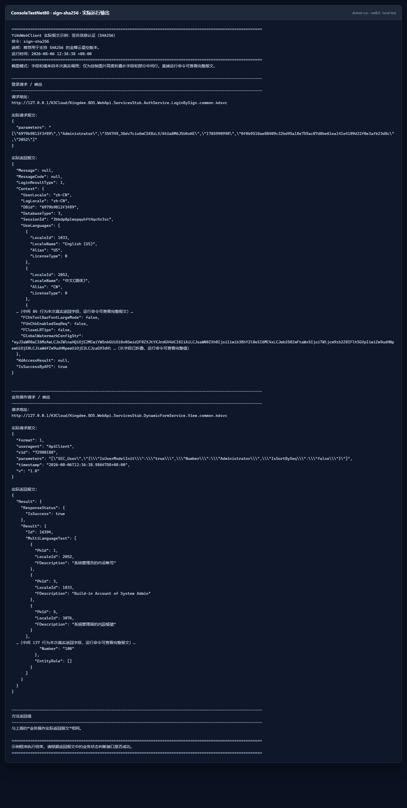

### 6.2 签名信息认证（SHA1，兼容旧版本）

PT-146911 `8.0.0.202205` 之前的版本不支持 SHA256 时，可改用 SHA1。

```csharp
using System;
using YiKdWebClient;
using YiKdWebClient.Model;

// 本代码块是独立示例，不依赖 6.1 中的变量。
const string formId = "SEC_User";
const string json = "{\"IsUserModelInit\":\"true\",\"Number\":\"Administrator\",\"IsSortBySeq\":\"false\"}";

using YiK3CloudClient client = new YiK3CloudClient
{
    LoginType = LoginType.LoginBySignSHA1
};

string resultJson = client.View(formId, json);

string loginRequestUrl = client.ReturnLoginWebModel.RequestUrl;
string loginRequestBody = client.ReturnLoginWebModel.RealRequestBody;
string loginResponseBody = client.ReturnLoginWebModel.RealResponseBody;
string operationRequestUrl = client.ReturnOperationWebModel.RequestUrl;
string operationRequestBody = client.ReturnOperationWebModel.RealRequestBody;
string operationResponseBody = client.ReturnOperationWebModel.RealResponseBody;

Console.WriteLine($"表单 ID（formId）：{formId}");
Console.WriteLine($"业务 JSON 参数（json）：{json}");
Console.WriteLine($"登录请求地址（loginRequestUrl）：{loginRequestUrl}");
Console.WriteLine($"登录请求报文（loginRequestBody）：{loginRequestBody}");
Console.WriteLine($"登录返回报文（loginResponseBody）：{loginResponseBody}");
Console.WriteLine($"业务请求地址（operationRequestUrl）：{operationRequestUrl}");
Console.WriteLine($"业务请求报文（operationRequestBody）：{operationRequestBody}");
Console.WriteLine($"业务返回报文（operationResponseBody）：{operationResponseBody}");
Console.WriteLine($"View 方法返回值（resultJson）：{resultJson}");
```

运行：

```powershell
dotnet run --project .\ConsoleTestNet80\ConsoleTestNet80.csproj -f net8.0 -- sign-sha1
```

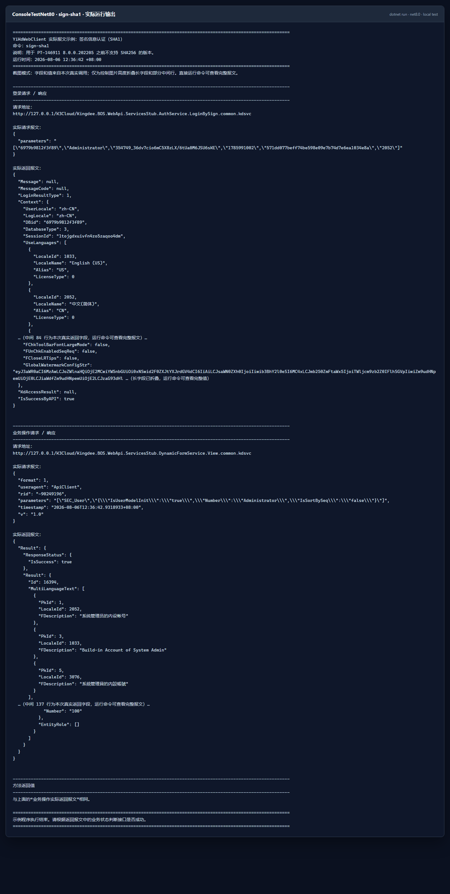

### 6.3 第三方系统登录授权

该方式读取 `appsettings.xml` 中的数据中心 ID、集成用户、应用 ID 和应用密钥。

```csharp
using System;
using YiKdWebClient;
using YiKdWebClient.Model;

const string formId = "SEC_User";
const string json = "{\"IsUserModelInit\":\"true\",\"Number\":\"Administrator\",\"IsSortBySeq\":\"false\"}";

// AppSettingsModel 默认从输出目录的 YiKdWebCfg/appsettings.xml 读取配置。
using YiK3CloudClient client = new YiK3CloudClient
{
    LoginType = LoginType.LoginByAppSecret
};

string resultJson = client.View(formId, json);

// 这些变量说明本次认证配置来自哪里；应用密钥不输出明文。
string dataCenterId = client.AppSettingsModel.XKDApiAcctID;
string integrationUser = client.AppSettingsModel.XKDApiUserName;
string appId = client.AppSettingsModel.XKDApiAppID;
string serverUrl = client.AppSettingsModel.XKDApiServerUrl;

string loginRequestUrl = client.ReturnLoginWebModel.RequestUrl;
string loginRequestBody = client.ReturnLoginWebModel.RealRequestBody;
string loginResponseBody = client.ReturnLoginWebModel.RealResponseBody;
string operationRequestUrl = client.ReturnOperationWebModel.RequestUrl;
string operationRequestBody = client.ReturnOperationWebModel.RealRequestBody;
string operationResponseBody = client.ReturnOperationWebModel.RealResponseBody;

Console.WriteLine($"配置文件中的数据中心 ID（dataCenterId）：{dataCenterId}");
Console.WriteLine($"配置文件中的集成用户（integrationUser）：{integrationUser}");
Console.WriteLine($"配置文件中的应用 ID（appId）：{appId}");
Console.WriteLine("配置文件中的应用密钥：******");
Console.WriteLine($"配置文件中的服务地址（serverUrl）：{serverUrl}");
Console.WriteLine($"表单 ID（formId）：{formId}");
Console.WriteLine($"业务 JSON 参数（json）：{json}");
Console.WriteLine($"登录请求地址（loginRequestUrl）：{loginRequestUrl}");
Console.WriteLine($"登录请求报文（loginRequestBody）：{loginRequestBody}");
Console.WriteLine($"登录返回报文（loginResponseBody）：{loginResponseBody}");
Console.WriteLine($"业务请求地址（operationRequestUrl）：{operationRequestUrl}");
Console.WriteLine($"业务请求报文（operationRequestBody）：{operationRequestBody}");
Console.WriteLine($"业务返回报文（operationResponseBody）：{operationResponseBody}");
Console.WriteLine($"View 方法返回值（resultJson）：{resultJson}");
```

运行：

```powershell
dotnet run --project .\ConsoleTestNet80\ConsoleTestNet80.csproj -f net8.0 -- app-secret
```

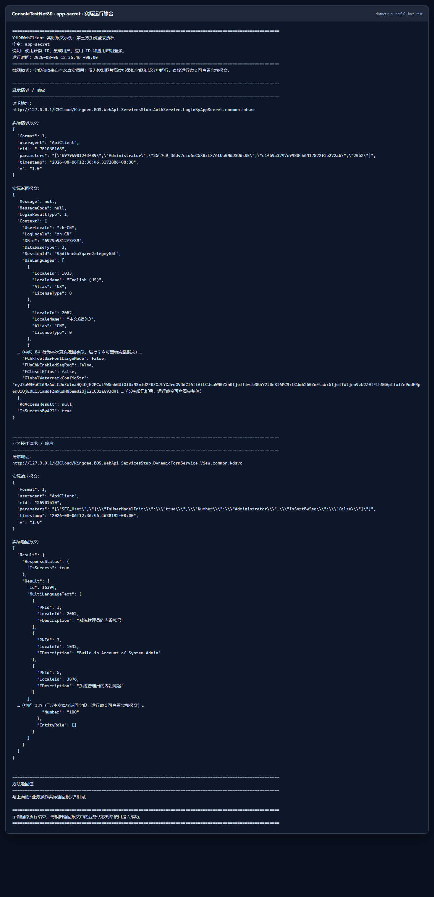

### 6.4 旧版用户名密码认证

旧版认证不依赖 `appsettings.xml` 中的应用 ID 和应用密钥，但需要服务地址、数据中心 ID、用户名、密码和语系。除兼容旧系统外，不建议新项目优先使用用户名密码方式。

```csharp
using System;
using YiKdWebClient;
using YiKdWebClient.Model;

const string formId = "SEC_User";
const string json = "{\"IsUserModelInit\":\"true\",\"Number\":\"Administrator\",\"IsSortBySeq\":\"false\"}";

string serverUrl = "http://127.0.0.1/K3Cloud/";
string dataCenterId = "6979b9812f3f89";
string userName = "demo";
string password = "123456"; // 示例密码，请替换为目标环境用户的实际密码
int localeId = 2052;

using YiK3CloudClient client = new YiK3CloudClient
{
    LoginType = LoginType.ValidateLogin,
    validateLoginSettingsModel = new ValidateLoginSettingsModel
    {
        Url = serverUrl,
        DbId = dataCenterId,
        UserName = userName,
        Password = password,
        lcid = localeId
    }
};

string resultJson = client.View(formId, json);

string loginRequestUrl = client.ReturnLoginWebModel.RequestUrl;
string loginRequestBody = client.ReturnLoginWebModel.RealRequestBody;
string loginResponseBody = client.ReturnLoginWebModel.RealResponseBody;
string operationRequestUrl = client.ReturnOperationWebModel.RequestUrl;
string operationRequestBody = client.ReturnOperationWebModel.RealRequestBody;
string operationResponseBody = client.ReturnOperationWebModel.RealResponseBody;

// 登录请求体中含有密码，输出前替换为星号；真实请求不受影响。
string maskedLoginRequestBody = loginRequestBody.Replace(password, "******");

Console.WriteLine($"服务地址（serverUrl）：{serverUrl}");
Console.WriteLine($"数据中心 ID（dataCenterId）：{dataCenterId}");
Console.WriteLine($"用户名（userName）：{userName}");
Console.WriteLine("密码（password）：******");
Console.WriteLine($"语系（localeId）：{localeId}");
Console.WriteLine($"表单 ID（formId）：{formId}");
Console.WriteLine($"业务 JSON 参数（json）：{json}");
Console.WriteLine($"登录请求地址（loginRequestUrl）：{loginRequestUrl}");
Console.WriteLine($"登录请求报文（maskedLoginRequestBody）：{maskedLoginRequestBody}");
Console.WriteLine($"登录返回报文（loginResponseBody）：{loginResponseBody}");
Console.WriteLine($"业务请求地址（operationRequestUrl）：{operationRequestUrl}");
Console.WriteLine($"业务请求报文（operationRequestBody）：{operationRequestBody}");
Console.WriteLine($"业务返回报文（operationResponseBody）：{operationResponseBody}");
Console.WriteLine($"View 方法返回值（resultJson）：{resultJson}");
```

把代码复制到控制台项目的 `Program.cs` 后直接运行即可，不需要设置环境变量：

```powershell
dotnet run
```

`123456` 仅用于说明密码变量应填写在哪里，接入时必须替换成目标环境中 `userName` 对应用户的真实密码。截图中的登录请求使用了本地测试密码，但展示前已替换为 `******`。

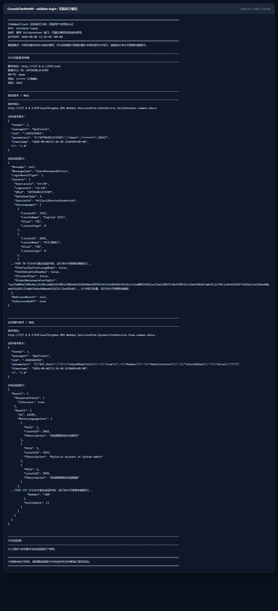

### 6.5 集成密钥文件认证

将目标环境生成的 `.cnf` 集成密钥文件放到 `YiKdWebCfg`，并确保它会复制到输出目录。

```csharp
using System;
using System.IO;
using YiKdWebClient;
using YiKdWebClient.Model;

const string formId = "SEC_User";
const string json = "{\"IsUserModelInit\":\"true\",\"Number\":\"Administrator\",\"IsSortBySeq\":\"false\"}";

string cnfFilePath = Path.Combine(
    AppContext.BaseDirectory,
    "YiKdWebCfg",
    "API测试.cnf");
string serverUrl = "http://127.0.0.1/K3Cloud/";

using YiK3CloudClient client = new YiK3CloudClient
{
    LoginType = LoginType.LoginBySimplePassport,
    LoginBySimplePassportModel = new LoginBySimplePassportModel
    {
        Url = serverUrl,
        CnfFilePath = cnfFilePath
    }
};

string resultJson = client.View(formId, json);

string loginRequestUrl = client.ReturnLoginWebModel.RequestUrl;
string loginRequestBody = client.ReturnLoginWebModel.RealRequestBody;
string loginResponseBody = client.ReturnLoginWebModel.RealResponseBody;
string operationRequestUrl = client.ReturnOperationWebModel.RequestUrl;
string operationRequestBody = client.ReturnOperationWebModel.RealRequestBody;
string operationResponseBody = client.ReturnOperationWebModel.RealResponseBody;

Console.WriteLine($"服务地址（serverUrl）：{serverUrl}");
Console.WriteLine($"集成密钥文件路径（cnfFilePath）：{cnfFilePath}");
Console.WriteLine($"表单 ID（formId）：{formId}");
Console.WriteLine($"业务 JSON 参数（json）：{json}");
Console.WriteLine($"登录请求地址（loginRequestUrl）：{loginRequestUrl}");
Console.WriteLine($"登录请求报文（loginRequestBody）：{loginRequestBody}");
Console.WriteLine($"登录返回报文（loginResponseBody）：{loginResponseBody}");
Console.WriteLine($"业务请求地址（operationRequestUrl）：{operationRequestUrl}");
Console.WriteLine($"业务请求报文（operationRequestBody）：{operationRequestBody}");
Console.WriteLine($"业务返回报文（operationResponseBody）：{operationResponseBody}");
Console.WriteLine($"View 方法返回值（resultJson）：{resultJson}");
```

运行：

```powershell
dotnet run --project .\ConsoleTestNet80\ConsoleTestNet80.csproj -f net8.0 -- simple-passport
```

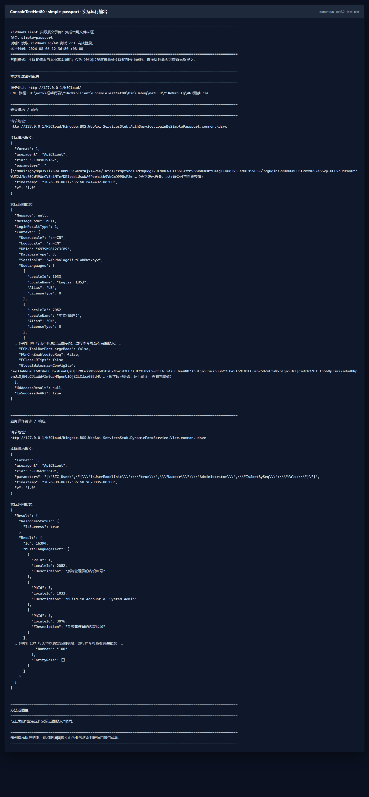

### 6.6 API 请求头签名认证

API 请求头签名模式不会先调用登录验证接口，而是直接给业务请求生成签名请求头，因此可以减少一次 Web 请求。原文档同时提醒：官方已经删除过该方式对应的帖子和算法说明，生产使用前应确认目标版本仍然支持。

```csharp
using System;
using YiKdWebClient;
using YiKdWebClient.Model;

const string formId = "SEC_User";
const string json = "{\"IsUserModelInit\":\"true\",\"Number\":\"Administrator\",\"IsSortBySeq\":\"false\"}";

using YiK3CloudClient client = new YiK3CloudClient
{
    LoginType = LoginType.LoginByApiSignHeaders
};

string resultJson = client.View(formId, json);

// 该模式没有单独的登录请求，认证信息位于业务请求头中。
string requestHeaders = client.RequestHeadersString;
string operationRequestUrl = client.ReturnOperationWebModel.RequestUrl;
string operationRequestBody = client.ReturnOperationWebModel.RealRequestBody;
string operationResponseBody = client.ReturnOperationWebModel.RealResponseBody;

Console.WriteLine($"表单 ID（formId）：{formId}");
Console.WriteLine($"业务 JSON 参数（json）：{json}");
Console.WriteLine($"可复制到 Postman/ApiPost 的请求头（requestHeaders）：{requestHeaders}");
Console.WriteLine($"业务请求地址（operationRequestUrl）：{operationRequestUrl}");
Console.WriteLine($"业务请求报文（operationRequestBody）：{operationRequestBody}");
Console.WriteLine($"业务返回报文（operationResponseBody）：{operationResponseBody}");
Console.WriteLine($"View 方法返回值（resultJson）：{resultJson}");
```

运行：

```powershell
dotnet run --project .\ConsoleTestNet80\ConsoleTestNet80.csproj -f net8.0 -- api-sign-headers
```

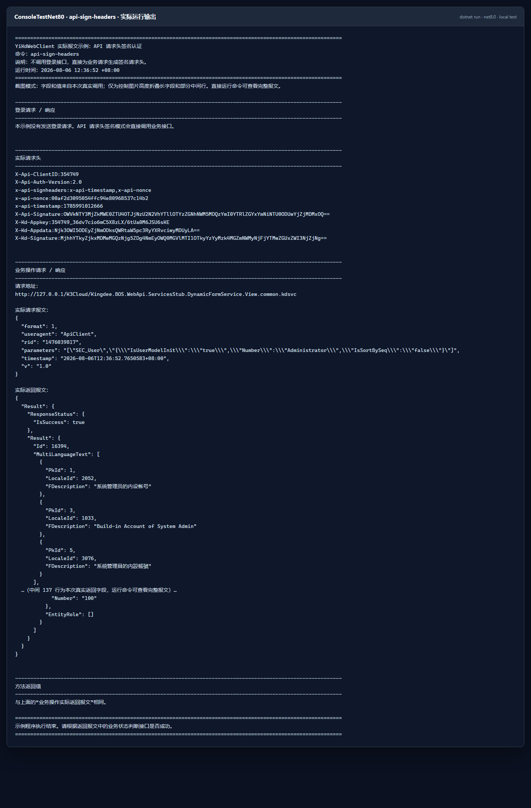

### 6.7 不通过固定配置文件，动态传入授权信息

以下场景适合代码动态配置：

1. 同一服务需要连接多个金蝶环境或多个数据中心；
2. 不同业务操作需要切换集成用户；
3. 配置来自数据库、配置中心或环境变量，而不是固定 XML 文件。

```csharp
using System;
using YiKdWebClient;
using YiKdWebClient.Model;

const string formId = "SEC_User";
const string json = "{\"IsUserModelInit\":\"true\",\"Number\":\"Administrator\",\"IsSortBySeq\":\"false\"}";

// 这些值可以来自数据库、配置中心或环境变量；请替换为自己的环境信息。
string dataCenterId = "替换为数据中心 ID";
string integrationUser = "替换为集成用户";
string appId = "替换为应用 ID";
string appSecret = "替换为应用密钥";
string localeId = "2052";
string organizationNumber = ""; // 可为空
string serverUrl = "http://127.0.0.1/K3Cloud/";

AppSettingsModel settings = new AppSettingsModel
{
    XKDApiAcctID = dataCenterId,
    XKDApiUserName = integrationUser,
    XKDApiAppID = appId,
    XKDApiAppSec = appSecret,
    XKDApiLCID = localeId,
    XKDApiOrgNum = organizationNumber,
    XKDApiServerUrl = serverUrl
};

using YiK3CloudClient client = new YiK3CloudClient
{
    AppSettingsModel = settings,
    LoginType = LoginType.LoginByAppSecret
};

string resultJson = client.View(formId, json);

string loginRequestUrl = client.ReturnLoginWebModel.RequestUrl;
string loginRequestBody = client.ReturnLoginWebModel.RealRequestBody;
string loginResponseBody = client.ReturnLoginWebModel.RealResponseBody;
string operationRequestUrl = client.ReturnOperationWebModel.RequestUrl;
string operationRequestBody = client.ReturnOperationWebModel.RealRequestBody;
string operationResponseBody = client.ReturnOperationWebModel.RealResponseBody;

Console.WriteLine($"代码传入的数据中心 ID（dataCenterId）：{dataCenterId}");
Console.WriteLine($"代码传入的集成用户（integrationUser）：{integrationUser}");
Console.WriteLine($"代码传入的应用 ID（appId）：{appId}");
Console.WriteLine("代码传入的应用密钥（appSecret）：******");
Console.WriteLine($"代码传入的语系（localeId）：{localeId}");
Console.WriteLine($"代码传入的组织编码（organizationNumber）：{organizationNumber}");
Console.WriteLine($"代码传入的服务地址（serverUrl）：{serverUrl}");
Console.WriteLine($"表单 ID（formId）：{formId}");
Console.WriteLine($"业务 JSON 参数（json）：{json}");
Console.WriteLine($"登录请求地址（loginRequestUrl）：{loginRequestUrl}");
Console.WriteLine($"登录请求报文（loginRequestBody）：{loginRequestBody}");
Console.WriteLine($"登录返回报文（loginResponseBody）：{loginResponseBody}");
Console.WriteLine($"业务请求地址（operationRequestUrl）：{operationRequestUrl}");
Console.WriteLine($"业务请求报文（operationRequestBody）：{operationRequestBody}");
Console.WriteLine($"业务返回报文（operationResponseBody）：{operationResponseBody}");
Console.WriteLine($"View 方法返回值（resultJson）：{resultJson}");
```

运行：

```powershell
dotnet run --project .\ConsoleTestNet80\ConsoleTestNet80.csproj -f net8.0 -- dynamic-config
```

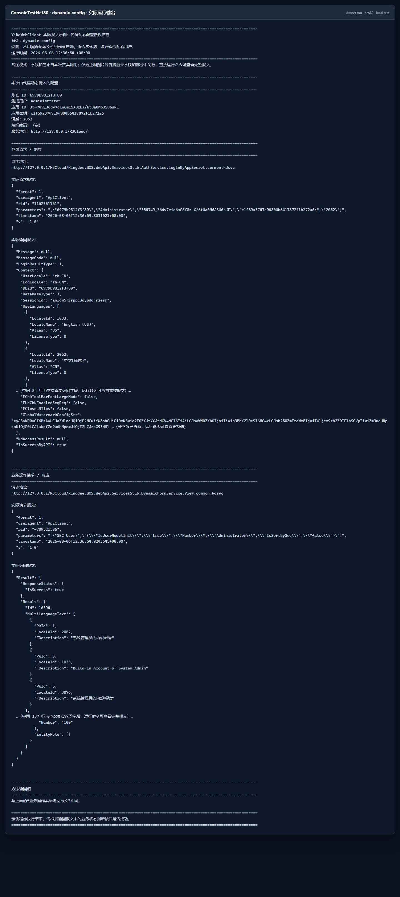

### 6.8 自定义配置文件路径

必须在创建 `YiK3CloudClient` 之前设置路径。

```csharp
using System;
using YiKdWebClient;
using YiKdWebClient.CommonService;
using YiKdWebClient.Model;

const string formId = "SEC_User";
const string json = "{\"IsUserModelInit\":\"true\",\"Number\":\"Administrator\",\"IsSortBySeq\":\"false\"}";

string configFilePath = @"D:\configs\kingdee\appsettings.xml";

// 必须先设置配置文件路径，再创建客户端。
XmlConfigHelper.AppConfigPath = configFilePath;

using YiK3CloudClient client = new YiK3CloudClient
{
    LoginType = LoginType.LoginBySignSHA256
};

string resultJson = client.View(formId, json);

string loginRequestUrl = client.ReturnLoginWebModel.RequestUrl;
string loginRequestBody = client.ReturnLoginWebModel.RealRequestBody;
string loginResponseBody = client.ReturnLoginWebModel.RealResponseBody;
string operationRequestUrl = client.ReturnOperationWebModel.RequestUrl;
string operationRequestBody = client.ReturnOperationWebModel.RealRequestBody;
string operationResponseBody = client.ReturnOperationWebModel.RealResponseBody;

Console.WriteLine($"本次配置文件路径（configFilePath）：{configFilePath}");
Console.WriteLine($"表单 ID（formId）：{formId}");
Console.WriteLine($"业务 JSON 参数（json）：{json}");
Console.WriteLine($"登录请求地址（loginRequestUrl）：{loginRequestUrl}");
Console.WriteLine($"登录请求报文（loginRequestBody）：{loginRequestBody}");
Console.WriteLine($"登录返回报文（loginResponseBody）：{loginResponseBody}");
Console.WriteLine($"业务请求地址（operationRequestUrl）：{operationRequestUrl}");
Console.WriteLine($"业务请求报文（operationRequestBody）：{operationRequestBody}");
Console.WriteLine($"业务返回报文（operationResponseBody）：{operationResponseBody}");
Console.WriteLine($"View 方法返回值（resultJson）：{resultJson}");
```

示例运行器默认通过 `YIKD_CONFIG_PATH` 指定路径：

```powershell
$env:YIKD_CONFIG_PATH = 'D:\configs\kingdee\appsettings.xml'
dotnet run --project .\ConsoleTestNet80\ConsoleTestNet80.csproj -f net8.0 -- custom-config-path
```

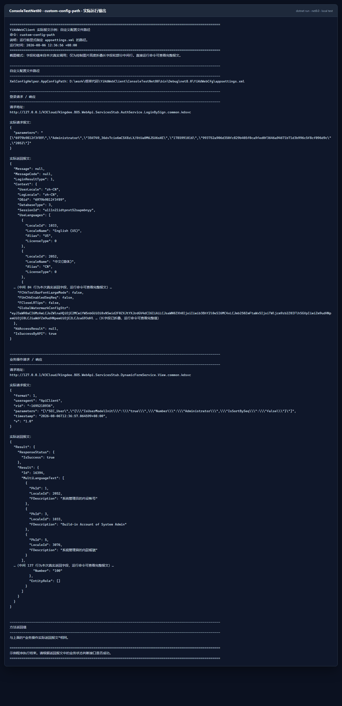

### 6.9 如何查看真实请求和响应

前面每个完整示例都已经演示了真实报文属性，不需要再从本小节复制一段公共代码。理解下面三个对象的职责，就能判断应该读取哪个变量：

- `resultJson` 是当前方法的直接返回值，适合业务代码继续反序列化和判断成功状态；
- `client.ReturnLoginWebModel` 保存本次自动登录的 URL、请求体和响应体；
- `client.ReturnOperationWebModel` 保存本次业务操作的 URL、请求体和响应体；
- `client.RequestHeadersString` 仅在 API 请求头签名模式下用于查看可复制的签名请求头。

复制 URL、请求头和请求体到 Postman/ApiPost 时，要注意时间戳、随机数、签名和会话信息可能很快失效。调试完成后也不要把包含密码、密钥、Cookie 或 SessionId 的导出文件提交到仓库。

## 7. JSON 参数与接口功能列表

传给 YiKdWebClient 方法的 JSON 与金蝶官方文档要求的参数格式一致。客户端会负责外层 HTTP 报文包装。例如：

```csharp
using System;
using YiKdWebClient;
using YiKdWebClient.Model;

// formId 决定调用哪个业务对象；json 是该接口要求的业务参数。
string formId = "SEC_User";
string json = @"{""IsUserModelInit"":""true"",""Number"":""Administrator"",""IsSortBySeq"":""false""}";

using YiK3CloudClient client = new YiK3CloudClient
{
    LoginType = LoginType.LoginBySignSHA256
};

string resultJson = client.View(formId, json);

// resultJson 是可以直接反序列化的 View 方法返回值。
Console.WriteLine($"View 方法返回值（resultJson）：{resultJson}");
```

已封装的主要接口如下。功能名称尽量与金蝶官方名称保持一致：

| 接口名称 | 接口含义 |
| --- | --- |
| `Save` | 保存 |
| `BatchSave` | 批量保存 |
| `Audit` | 审核 |
| `Delete` | 删除 |
| `UnAudit` | 反审核 |
| `Submit` | 提交 |
| `View` | 查看 |
| `ExecuteBillQuery` | 单据查询 |
| `Draft` | 暂存 |
| `Allocate` | 分配 |
| `ExecuteOperation` | 操作接口 |
| `FlexSave` | 弹性域保存 |
| `SendMsg` | 发送消息 |
| `Push` | 下推 |
| `GroupSave` | 分组保存 |
| `Disassembly` | 拆单 |
| `QueryBusinessInfo` | 查询单据信息 |
| `QueryGroupInfo` | 查询分组信息 |
| `WorkflowAudit` | 工作流审批 |
| `GroupDelete` | 分组删除 |
| `CancelAllocate` | 取消分配 |
| `SwitchOrg` | 切换组织接口 |
| `CancelAssign` | 撤销服务接口 |
| `GetSysReportData` | 获取报表数据 |
| `AttachmentUpload` | 上传附件 |
| `AttachmentDownLoad` | 下载附件 |

## 8. 单点登录

项目支持 SSO V1、V2、V3 和 V4。下面以 V4 为例。它会在本地生成签名参数和入口 URL，不发送 HTTP 请求，因此没有“返回报文”。

```csharp
using System;
using YiKdWebClient.SSO;

// 本代码块可以独立运行。userName 是要免密登录的金蝶用户名。
string userName = "Administrator";
SSOHelper helper = new SSOHelper();

// 未单独传 URL 时，服务地址及认证信息来自 YiKdWebCfg/appsettings.xml。
helper.GetSsoUrlsV4(userName);

// 把截图中的每一项先赋给名称明确的变量，便于复制后继续使用。
string? dataCenterId = helper.simplePassportLoginArg.dbid;
string? appId = helper.simplePassportLoginArg.appid;
string? loginUserName = helper.simplePassportLoginArg.username;
long? timestamp = helper.timestamp;
string? signedData = helper.simplePassportLoginArg.signeddata;
string? argumentJson = helper.argJosn;
string? argumentBase64 = helper.argJsonBase64;
string silverlightUrl = helper.SSOLoginUrlObject.silverlightUrl;
string html5Url = helper.SSOLoginUrlObject.html5Url;
string wpfUrl = helper.SSOLoginUrlObject.wpfUrl;

Console.WriteLine($"数据中心 ID（dataCenterId）：{dataCenterId}");
Console.WriteLine($"应用 ID（appId）：{appId}");
Console.WriteLine($"登录用户名（loginUserName）：{loginUserName}");
Console.WriteLine($"时间戳（timestamp）：{timestamp}");
Console.WriteLine($"签名（signedData）：{signedData}");
Console.WriteLine($"原始 SSO 参数 JSON（argumentJson）：{argumentJson}");
Console.WriteLine($"Base64 参数（argumentBase64）：{argumentBase64}");
Console.WriteLine($"Silverlight 入口（silverlightUrl）：{silverlightUrl}");
Console.WriteLine($"HTML5 入口（html5Url）：{html5Url}");
Console.WriteLine($"WPF 入口（wpfUrl）：{wpfUrl}");

// 旧版本按目标环境需要选择：
// helper.GetSsoUrlsV3(userName);
// helper.GetSsoUrlsV2(userName);
// helper.GetSsoUrlsV1(userName);
```

运行：

```powershell
dotnet run --project .\ConsoleTestNet80\ConsoleTestNet80.csproj -f net8.0 -- sso-v4
```

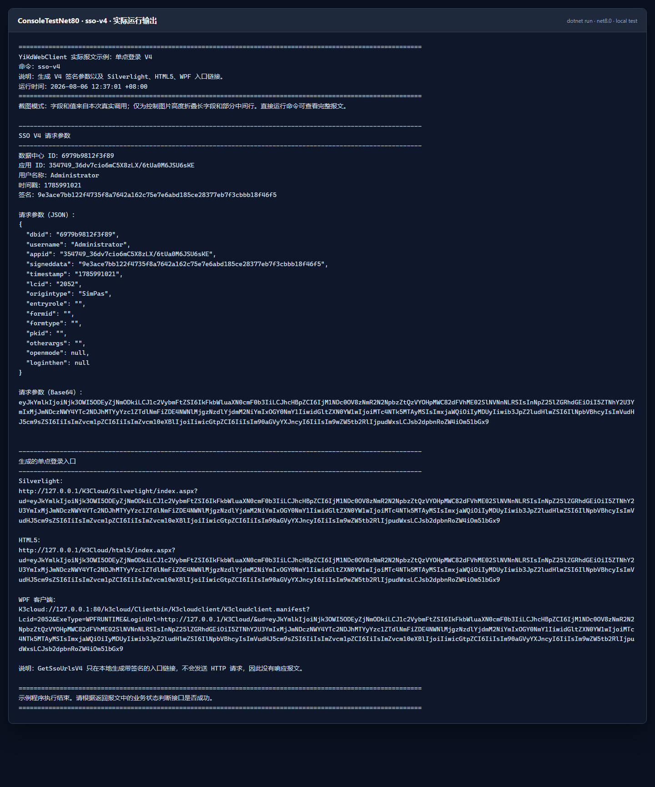

## 9. 自定义 WebAPI

官方自定义 WebAPI 报文格式与参数说明：<https://vip.kingdee.com/article/97030089581136896?specialId=448928749460099072&productLineId=1&isKnowledge=2&lang=zh-CN>

目标环境必须先部署服务端自定义 WebAPI。本仓库示例调用：

```text
GlobalServiceCustom.WebApi.DataServiceHandler.CommonRunnerService
```

### 9.1 服务端项目采用直接 DLL 引用

`GlobalServiceCustom.WebApi` 是 .NET Framework 4.8 类库，当前不再使用 `app.config`、程序集绑定重定向或 `packages.config`。编译所需程序集直接放在项目的 `kdbin` 目录，并通过 `.csproj` 中的相对 `HintPath` 引用：

- `Kingdee.BOS.dll`
- `Kingdee.BOS.ServiceFacade.KDServiceFx.dll`
- `Kingdee.BOS.ServiceHelper.dll`
- `Kingdee.BOS.WebApi.ServicesStub.dll`
- `Newtonsoft.Json.dll`

这些引用均设置了 `Private=False`。因此构建输出只有自定义插件 DLL 和可选 PDB，不会把金蝶运行时程序集复制到输出目录：

```powershell
dotnet build .\GlobalServiceCustom.WebApi\GlobalServiceCustom.WebApi.csproj -c Release
```

部署时使用 `GlobalServiceCustom.WebApi/bin/Release/GlobalServiceCustom.WebApi.dll`，不要用仓库 `kdbin` 中的 DLL 覆盖服务器程序集。更换目标金蝶环境或产品版本时，应从该目标环境取得同版本 DLL，替换 `kdbin` 中的编译引用后重新构建，避免不同补丁版本之间的 API 不兼容。

### 9.2 客户端调用

服务定位对象中的命名空间、类名和方法名必须与服务器端部署内容完全一致：

```csharp
using System;
using System.Text.Json;
using YiKdWebClient;
using YiKdWebClient.Model;

using YiK3CloudClient client = new YiK3CloudClient
{
    LoginType = LoginType.LoginByAppSecret
};

// sql 是传给服务端 CommonRunnerService 方法的实际参数。
string sql = "SELECT TOP 10 * FROM T_BD_MATERIAL_L";
string jsonString = JsonSerializer.Serialize(new
{
    parameters = new[] { sql }
});

// 三个定位值分别来自服务端项目的命名空间、类名和公开方法名。
string projectNamespace = "GlobalServiceCustom.WebApi";
string projectClassName = "DataServiceHandler";
string projectMethodName = "CommonRunnerService";

CustomServicesStubpath service = new CustomServicesStubpath
{
    ProjetNamespace = projectNamespace,
    ProjetClassName = projectClassName,
    ProjetClassMethod = projectMethodName
};

string resultJson = client.CustomBusinessServiceByParameters(jsonString, service);

string loginRequestUrl = client.ReturnLoginWebModel.RequestUrl;
string loginRequestBody = client.ReturnLoginWebModel.RealRequestBody;
string loginResponseBody = client.ReturnLoginWebModel.RealResponseBody;
string operationRequestUrl = client.ReturnOperationWebModel.RequestUrl;
string operationRequestBody = client.ReturnOperationWebModel.RealRequestBody;
string operationResponseBody = client.ReturnOperationWebModel.RealResponseBody;

Console.WriteLine($"服务端命名空间（projectNamespace）：{projectNamespace}");
Console.WriteLine($"服务端类名（projectClassName）：{projectClassName}");
Console.WriteLine($"服务端方法名（projectMethodName）：{projectMethodName}");
Console.WriteLine($"SQL 参数（sql）：{sql}");
Console.WriteLine($"接口参数 JSON（jsonString）：{jsonString}");
Console.WriteLine($"登录请求地址（loginRequestUrl）：{loginRequestUrl}");
Console.WriteLine($"登录请求报文（loginRequestBody）：{loginRequestBody}");
Console.WriteLine($"登录返回报文（loginResponseBody）：{loginResponseBody}");
Console.WriteLine($"业务请求地址（operationRequestUrl）：{operationRequestUrl}");
Console.WriteLine($"业务请求报文（operationRequestBody）：{operationRequestBody}");
Console.WriteLine($"业务返回报文（operationResponseBody）：{operationResponseBody}");
Console.WriteLine($"自定义接口返回值（resultJson）：{resultJson}");
```

原有服务调用结构截图保留在统一截图目录中：

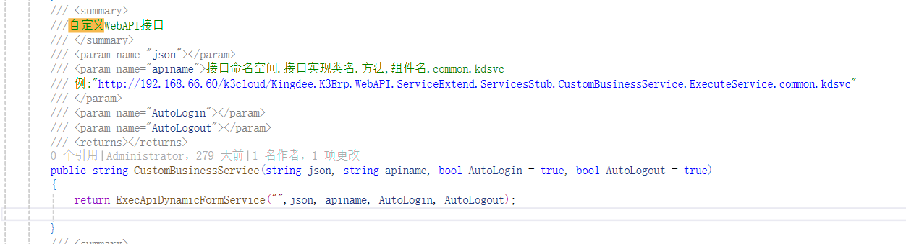

运行：

```powershell
dotnet run --project .\ConsoleTestNet80\ConsoleTestNet80.csproj -f net8.0 -- custom-webapi
```

当前本地测试环境成功返回了 SQL 查询结果：

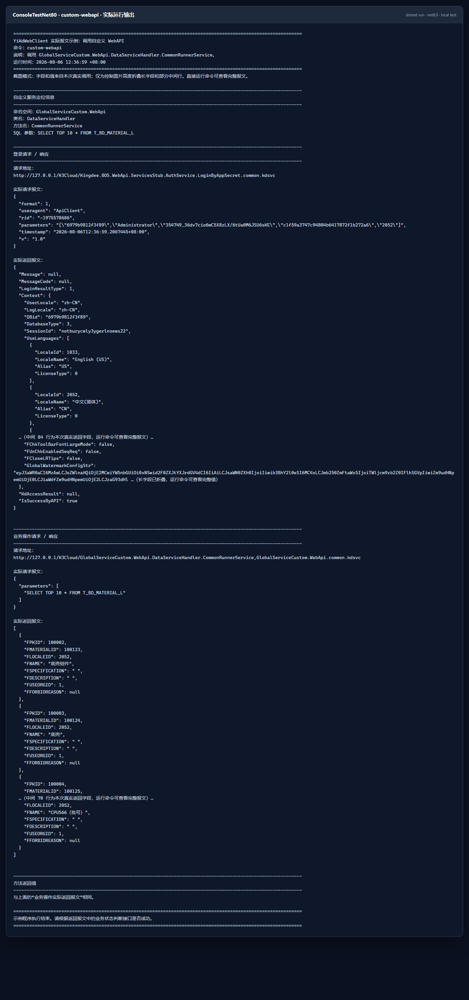

## 10. 文件上传

官方附件上传报文结构与原理：<https://vip.kingdee.com/article/296577252589190400?productLineId=1&isKnowledge=2&lang=zh-CN>

上传示例默认读取 `ConsoleTestNet80/SampleFiles/upload-demo.txt`。接入自己的环境前，请替换目标表单、单据内码和单据编号，并确认金蝶环境已经配置附件存储。

### 10.1 文件路径分块上传，直接返回最终结果

```csharp
using System;
using System.IO;
using YiKdWebClient;
using YiKdWebClient.Model;
using YiKdWebClient.ToolsHelper;

// 本代码块包含全部输入，不依赖其他上传示例。
string serverUrl = "http://127.0.0.1/K3Cloud/";
string cnfFilePath = Path.Combine(AppContext.BaseDirectory, "YiKdWebCfg", "API测试.cnf");
string filePath = Path.Combine(AppContext.BaseDirectory, "SampleFiles", "upload-demo.txt");
string formId = "SAL_SaleOrder";
string interId = "100020";
string billNumber = "XSDD000019";
long chunkSize = 2L * 1024 * 1024;

if (!File.Exists(filePath))
{
    throw new FileNotFoundException("找不到待上传文件，请修改 filePath。", filePath);
}

using YiK3CloudClient client = new YiK3CloudClient
{
    LoginType = LoginType.LoginBySimplePassport,
    LoginBySimplePassportModel = new LoginBySimplePassportModel
    {
        Url = serverUrl,
        CnfFilePath = cnfFilePath
    }
};

UploadModel uploadModel = new UploadModel();
uploadModel.data.FormId = formId;
uploadModel.data.InterId = interId;
uploadModel.data.BillNO = billNumber;

string resultJson = AttachmentHelper.AttachmentUploadByFilePath(
    filePath,
    client,
    uploadModel,
    chunkSize);

string loginRequestUrl = client.ReturnLoginWebModel.RequestUrl;
string loginRequestBody = client.ReturnLoginWebModel.RealRequestBody;
string loginResponseBody = client.ReturnLoginWebModel.RealResponseBody;
string operationRequestUrl = client.ReturnOperationWebModel.RequestUrl;
string operationRequestBody = client.ReturnOperationWebModel.RealRequestBody;
string operationResponseBody = client.ReturnOperationWebModel.RealResponseBody;

Console.WriteLine($"待上传文件（filePath）：{filePath}");
Console.WriteLine($"文件大小：{new FileInfo(filePath).Length} 字节");
Console.WriteLine($"目标表单（formId）：{formId}");
Console.WriteLine($"单据内码（interId）：{interId}");
Console.WriteLine($"单据编号（billNumber）：{billNumber}");
Console.WriteLine($"分块大小（chunkSize）：{chunkSize} 字节");
Console.WriteLine($"登录请求地址（loginRequestUrl）：{loginRequestUrl}");
Console.WriteLine($"登录请求报文（loginRequestBody）：{loginRequestBody}");
Console.WriteLine($"登录返回报文（loginResponseBody）：{loginResponseBody}");
Console.WriteLine($"最后一块请求地址（operationRequestUrl）：{operationRequestUrl}");
Console.WriteLine($"最后一块请求报文（operationRequestBody）：{operationRequestBody}");
Console.WriteLine($"最后一块返回报文（operationResponseBody）：{operationResponseBody}");
Console.WriteLine($"上传方法返回值（resultJson）：{resultJson}");
```

运行：

```powershell
dotnet run --project .\ConsoleTestNet80\ConsoleTestNet80.csproj -f net8.0 -- upload-file
```

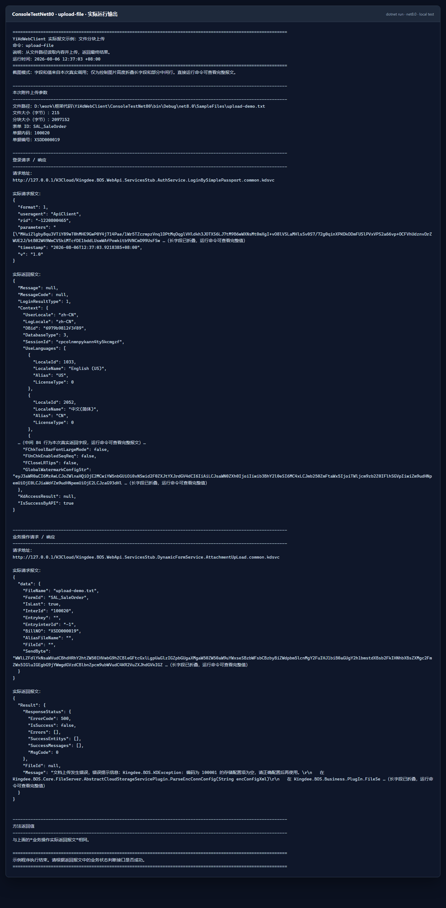

### 10.2 文件路径分块上传，获取完整进度

```csharp
using System;
using System.IO;
using YiKdWebClient;
using YiKdWebClient.Model;
using YiKdWebClient.ToolsHelper;

// 10.2 是完整独立示例，因此重新声明客户端、文件参数和上传模型。
string serverUrl = "http://127.0.0.1/K3Cloud/";
string cnfFilePath = Path.Combine(AppContext.BaseDirectory, "YiKdWebCfg", "API测试.cnf");
string filePath = Path.Combine(AppContext.BaseDirectory, "SampleFiles", "upload-demo.txt");
string formId = "SAL_SaleOrder";
string interId = "100020";
string billNumber = "XSDD000019";
long chunkSize = 2L * 1024 * 1024;

if (!File.Exists(filePath))
{
    throw new FileNotFoundException("找不到待上传文件，请修改 filePath。", filePath);
}

using YiK3CloudClient client = new YiK3CloudClient
{
    LoginType = LoginType.LoginBySimplePassport,
    LoginBySimplePassportModel = new LoginBySimplePassportModel
    {
        Url = serverUrl,
        CnfFilePath = cnfFilePath
    }
};

UploadModel uploadModel = new UploadModel();
uploadModel.data.FormId = formId;
uploadModel.data.InterId = interId;
uploadModel.data.BillNO = billNumber;

Action<FileChunk, YiK3CloudClient> progress = (chunk, currentClient) =>
{
    long chunkNumber = chunk.Chunkindex + 1;
    bool isLastChunk = chunk.IsLast;
    string chunkRequestUrl = currentClient.ReturnOperationWebModel.RequestUrl;
    string chunkRequestBody = currentClient.ReturnOperationWebModel.RealRequestBody;
    string chunkResponseBody = currentClient.ReturnOperationWebModel.RealResponseBody;

    Console.WriteLine($"当前分块序号（chunkNumber）：{chunkNumber}");
    Console.WriteLine($"是否最后一块（isLastChunk）：{isLastChunk}");
    Console.WriteLine($"当前分块请求地址（chunkRequestUrl）：{chunkRequestUrl}");
    Console.WriteLine($"当前分块请求报文（chunkRequestBody）：{chunkRequestBody}");
    Console.WriteLine($"当前分块返回报文（chunkResponseBody）：{chunkResponseBody}");

    if (isLastChunk)
    {
        Console.WriteLine("所有分块处理结束");
    }
};

string resultJson = AttachmentHelper.AttachmentUploadByFilePath(
    filePath,
    client,
    uploadModel,
    chunkSize,
    progress);

Console.WriteLine($"待上传文件（filePath）：{filePath}");
Console.WriteLine($"目标表单（formId）：{formId}");
Console.WriteLine($"单据内码（interId）：{interId}");
Console.WriteLine($"单据编号（billNumber）：{billNumber}");
Console.WriteLine($"分块大小（chunkSize）：{chunkSize} 字节");
Console.WriteLine($"上传方法最终返回值（resultJson）：{resultJson}");
```

运行：

```powershell
dotnet run --project .\ConsoleTestNet80\ConsoleTestNet80.csproj -f net8.0 -- upload-progress
```

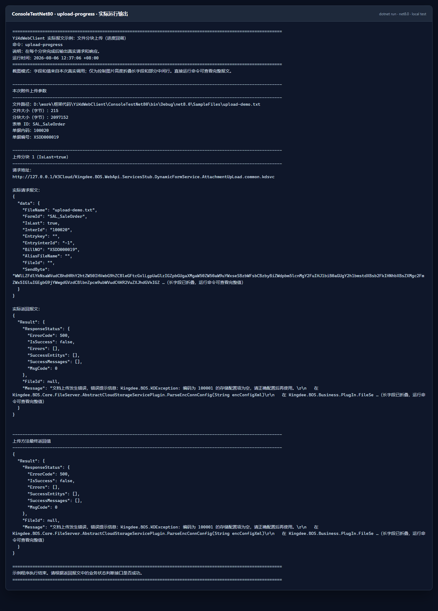

### 10.3 Base64 流分块上传

把文件内容转换为 Base64 后，调用 `AttachmentUploadByBase64`：

```csharp
using System;
using System.IO;
using YiKdWebClient;
using YiKdWebClient.Model;
using YiKdWebClient.ToolsHelper;

// 10.3 同样包含全部变量，可单独复制运行。
string serverUrl = "http://127.0.0.1/K3Cloud/";
string cnfFilePath = Path.Combine(AppContext.BaseDirectory, "YiKdWebCfg", "API测试.cnf");
string filePath = Path.Combine(AppContext.BaseDirectory, "SampleFiles", "upload-demo.txt");
string formId = "SAL_SaleOrder";
string interId = "100020";
string billNumber = "XSDD000019";
long chunkSize = 2L * 1024 * 1024;

if (!File.Exists(filePath))
{
    throw new FileNotFoundException("找不到待上传文件，请修改 filePath。", filePath);
}

string base64 = Convert.ToBase64String(File.ReadAllBytes(filePath));

using YiK3CloudClient client = new YiK3CloudClient
{
    LoginType = LoginType.LoginBySimplePassport,
    LoginBySimplePassportModel = new LoginBySimplePassportModel
    {
        Url = serverUrl,
        CnfFilePath = cnfFilePath
    }
};

UploadModel uploadModel = new UploadModel();
uploadModel.data.FormId = formId;
uploadModel.data.InterId = interId;
uploadModel.data.BillNO = billNumber;

string resultJson = AttachmentHelper.AttachmentUploadByBase64(
    base64,
    Path.GetFileName(filePath),
    client,
    uploadModel,
    chunkSize);

string loginRequestUrl = client.ReturnLoginWebModel.RequestUrl;
string loginRequestBody = client.ReturnLoginWebModel.RealRequestBody;
string loginResponseBody = client.ReturnLoginWebModel.RealResponseBody;
string operationRequestUrl = client.ReturnOperationWebModel.RequestUrl;
string operationRequestBody = client.ReturnOperationWebModel.RealRequestBody;
string operationResponseBody = client.ReturnOperationWebModel.RealResponseBody;

Console.WriteLine($"源文件（filePath）：{filePath}");
Console.WriteLine($"Base64 字符数（base64.Length）：{base64.Length}");
Console.WriteLine($"目标表单（formId）：{formId}");
Console.WriteLine($"单据内码（interId）：{interId}");
Console.WriteLine($"单据编号（billNumber）：{billNumber}");
Console.WriteLine($"分块大小（chunkSize）：{chunkSize} 字节");
Console.WriteLine($"登录请求地址（loginRequestUrl）：{loginRequestUrl}");
Console.WriteLine($"登录请求报文（loginRequestBody）：{loginRequestBody}");
Console.WriteLine($"登录返回报文（loginResponseBody）：{loginResponseBody}");
Console.WriteLine($"最后一块请求地址（operationRequestUrl）：{operationRequestUrl}");
Console.WriteLine($"最后一块请求报文（operationRequestBody）：{operationRequestBody}");
Console.WriteLine($"最后一块返回报文（operationResponseBody）：{operationResponseBody}");
Console.WriteLine($"上传方法返回值（resultJson）：{resultJson}");
```

运行：

```powershell
dotnet run --project .\ConsoleTestNet80\ConsoleTestNet80.csproj -f net8.0 -- upload-base64
```

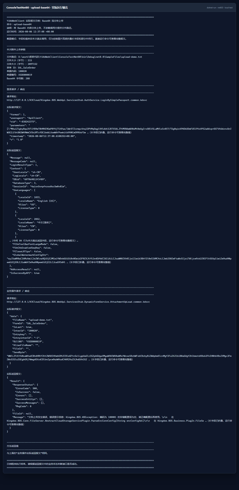

> [!NOTE]
> 当前截图中的三个上传请求都真实到达了本地金蝶服务，但测试环境返回 `ErrorCode: 500`，消息指出附件存储配置项为空。它是服务器端测试环境配置结果，不是伪造的成功报文，也不是示例进程崩溃。正确配置附件存储，并替换成目标环境中真实存在的表单与单据后，再根据 `ResponseStatus.IsSuccess` 判断上传是否成功。

## 11. 框架兼容性与依赖

当前库项目配置的目标框架：

```text
net10.0
net9.0
net8.0
net7.0
net6.0
net5.0
net481
net48
net472
net471
net47
net462
netstandard2.1
netstandard2.0
```

框架主要基于 .NET/Microsoft 基础类库实现：

- `System.Net.Http`
- `System.Text.Json`
- `System.Security.Cryptography.Cng`

项目不依赖金蝶官方 SDK，也不依赖 `Newtonsoft.Json`。部分旧目标框架会通过 NuGet 引用相应版本的 Microsoft 基础包，业务方无需额外引入第三方 JSON 框架。

## 12. 常见问题

### 12.1 找不到 `YiKdWebCfg/appsettings.xml`

确认文件属性会复制到输出目录。使用本仓库示例时重新构建：

```powershell
dotnet build .\ConsoleTestNet80\ConsoleTestNet80.csproj -f net8.0
```

也可以设置 `YIKD_CONFIG_PATH`，或在创建客户端前设置 `XmlConfigHelper.AppConfigPath`。

### 12.2 返回登录失败

依次检查：

1. 数据中心 ID 是否属于当前服务地址；
2. 集成用户是否在第三方系统登录授权范围内；
3. 应用 ID 与应用密钥是否成对；
4. 语系和组织编码是否适用于当前账套；
5. 服务器时间是否准确，避免签名时间戳偏差；
6. 旧版登录是否正确设置 `YIKD_VALIDATE_PASSWORD`。

### 12.3 登录成功，但业务调用失败

登录成功只代表身份验证通过。继续检查业务返回中的 `ResponseStatus`、权限、表单 ID、字段名、单据状态和组织范围。将控制台打印的实际 URL、请求头和请求体复制到 Postman/ApiPost，可帮助区分客户端参数问题与服务端业务规则问题。

### 12.4 `API测试.cnf` 无法使用

`.cnf` 文件必须由目标环境生成，并与服务地址和数据中心匹配。复制其他环境的文件通常无法正常登录。替换文件后重新构建，或用 `YIKD_CNF_PATH` 指向新文件。

### 12.5 上传返回存储配置错误

这表示请求已经到达附件接口，但服务器没有正确配置文件存储。请先在金蝶环境中完成附件/对象存储配置，再确认表单 ID、单据内码和单据编号真实存在。

### 12.6 README 截图为什么省略了部分行

完整登录上下文和单据对象可能包含上百行，Base64 字段也很长。截图生成器只折叠中间行和超长字段，字段来源仍是当次真实调用。直接运行对应示例命令即可查看完整输出。

## 13. 重新生成 README 截图

全部截图统一存放在 `docs/screenshots`，生成脚本是 `docs/generate-readme-screenshots.ps1`。脚本会依次运行 13 个示例，再使用 Microsoft Edge 无头模式把真实控制台输出保存为 PNG。

```powershell
$env:YIKD_VALIDATE_PASSWORD = '<替换为你的测试密码>'
powershell -NoProfile -ExecutionPolicy Bypass -File .\docs\generate-readme-screenshots.ps1
Remove-Item Env:\YIKD_VALIDATE_PASSWORD
```

安全措施：

- `validate-login` 的密码不会写入源码；
- 控制台输出会先脱敏；
- 截图脚本会再次替换密码，避免回归时意外泄漏；
- 临时 HTML 文件在每张截图生成后立即删除；
- 截图只保留实际请求/响应中适合公开测试仓库的内容。

## 14. 项目地址

- Gitee：<https://gitee.com/lnsyzjw/yi-kd-web-client>
- GitHub：<https://github.com/1609676823/YiKdWebClient>
- NuGet：<https://www.nuget.org/packages/YiKdWebClient>

本项目采用 [MIT License](./LICENSE)。
